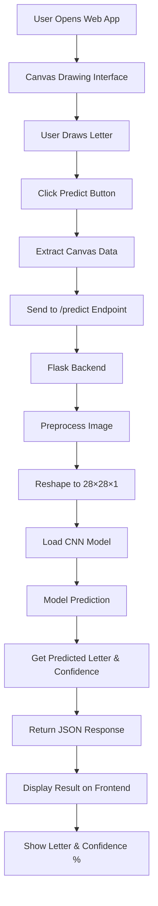
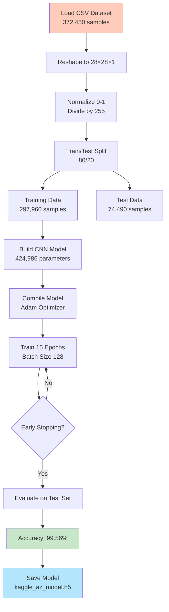
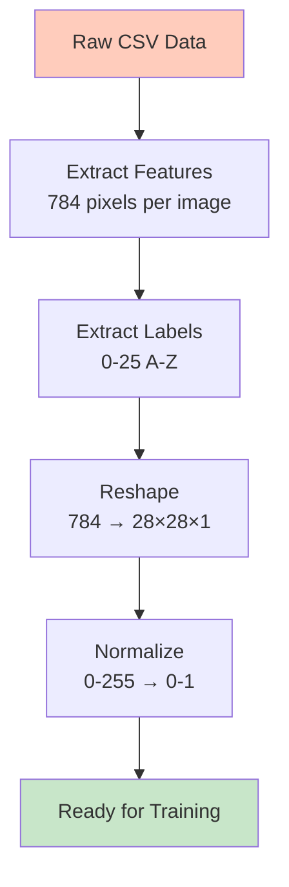
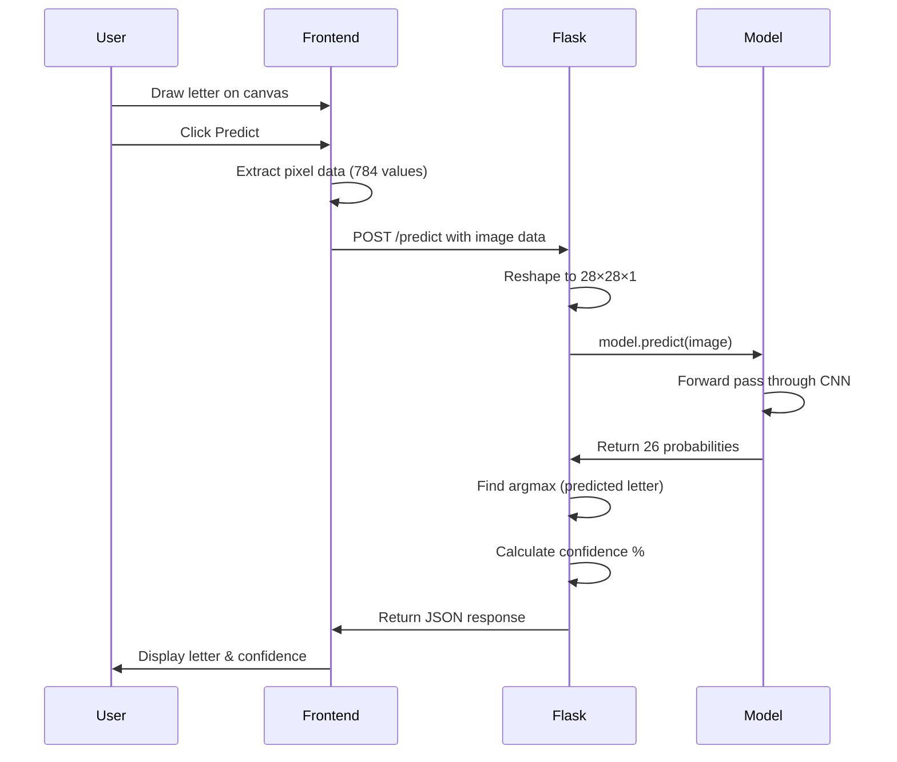

# Handwritten Letter Recognition

A deep learning web application that recognizes handwritten letters (A-Z) using a Convolutional Neural Network (CNN) trained on the Kaggle A-Z Handwritten Dataset.

## 📋 Project Overview

This project combines:
- **Backend**: Flask web server for API endpoints
- **Frontend**: Interactive canvas-based drawing interface
- **Model**: Pre-trained CNN achieving 99.56% accuracy on test data
- **Dataset**: 372,450 handwritten letter samples (28×28 pixels)

## 🏗️ Architecture

### Application Flow



### Model Architecture



```mermaid
graph LR
    A["Input<br/>28×28×1"] --> B["Conv2D 32<br/>3×3"] --> C["BatchNorm"] --> D["MaxPool"] 
    D --> E["Conv2D 64<br/>3×3"] --> F["BatchNorm"] --> G["MaxPool"]
    G --> H["Conv2D 128<br/>3×3"] --> I["BatchNorm"] --> J["MaxPool"]
    J --> K["Flatten"] --> L["Dense 256<br/>ReLU"] --> M["Dropout 0.4"]
    M --> N["Dense 128<br/>ReLU"] --> O["Dropout 0.4"]
    O --> P["Dense 26<br/>Softmax"]
    P --> Q["Output<br/>A-Z Probabilities"]
    
    style A fill:#e1f5ff
    style Q fill:#c8e6c9
    style P fill:#fff9c4
```

### Training Pipeline



### Data Processing Flow



### Prediction Pipeline



## 📁 Project Structure

```
mnist letters/
├── app.py                          # Flask application
├── train.ipynb                     # Training notebook
├── kaggle_az_model.h5             # Pre-trained CNN model
├── A_Z Handwritten Data.csv       # Training dataset
├── README.md                       # Project documentation
├── templates/
│   └── index.html                 # Web interface
└── static/
    ├── css/                       # Stylesheets
    ├── js/                        # JavaScript
    └── images/                    # Assets
```

## 🚀 Getting Started

### Prerequisites

```bash
pip install flask tensorflow numpy pandas scikit-learn
```

### Running the Application

```bash
python app.py
```

Then open your browser and navigate to `http://localhost:5000`

## 🎯 Features

- **Interactive Canvas**: Draw letters directly in the browser
- **Real-time Prediction**: Get instant recognition results
- **Confidence Score**: See the model's confidence percentage
- **Probability Distribution**: View all 26 letter probabilities
- **Clear Button**: Reset canvas for new predictions
- **Neural Network Visualization**: Understand how the model works

## 📊 Model Performance

| Metric | Value |
|--------|-------|
| Training Accuracy | 99.62% |
| Test Accuracy | 99.56% |
| Total Parameters | 424,986 |
| Model Size | 5.18 MB |
| Input Size | 28×28 pixels |
| Output Classes | 26 (A-Z) |

## 🔧 Technical Details

### Model Architecture

- **3 Convolutional Blocks**: Each with Conv2D → BatchNormalization → MaxPooling
- **Convolutional Filters**: 32 → 64 → 128
- **Dense Layers**: 256 → 128 → 26
- **Regularization**: Dropout (0.4) and Early Stopping
- **Optimizer**: Adam
- **Loss Function**: Sparse Categorical Crossentropy

### Training Configuration

- **Epochs**: 15 (with early stopping)
- **Batch Size**: 128
- **Learning Rate**: 0.001 (reduced to 0.0005 on plateau)
- **Validation Split**: 20%
- **Callbacks**: EarlyStopping, ReduceLROnPlateau

## 📝 API Endpoints

### GET /
Serves the main web interface.

**Response**: HTML page with canvas and prediction interface

### POST /predict
Predicts the handwritten letter from canvas data.

**Request Body**:
```json
{
  "image": [0, 0, 0, ..., 255, 255, 255]
}
```

**Response**:
```json
{
  "letter": "A",
  "confidence": 99.87,
  "probabilities": [0.9987, 0.0001, ..., 0.0002]
}
```

## 📚 Dataset Information

- **Source**: Kaggle A-Z Handwritten Dataset
- **Total Samples**: 372,450
- **Training Samples**: 297,960 (80%)
- **Test Samples**: 74,490 (20%)
- **Image Size**: 28×28 pixels (grayscale)
- **Classes**: 26 (A-Z)
- **File Size**: ~698 MB (CSV format)

## 🔍 How It Works

1. **User Input**: User draws a letter on the canvas
2. **Data Extraction**: Canvas pixels are extracted as 784 values (28×28)
3. **Preprocessing**: Image is reshaped and normalized
4. **Model Inference**: CNN processes the image through 3 convolutional blocks
5. **Prediction**: Model outputs 26 probabilities (one per letter)
6. **Result**: Highest probability letter is displayed with confidence score

## 💡 Tips for Best Results

- Draw letters clearly and centered on the canvas
- Use a smooth, continuous motion
- Fill the letter adequately (not too thin)
- Avoid overlapping strokes
- The model works best with handwriting similar to the training data

## 📖 References

- [Kaggle A-Z Handwritten Dataset](https://www.kaggle.com/datasets/sachinpatel21/az-handwritten-alphabets-in-csv-format)
- [TensorFlow/Keras Documentation](https://www.tensorflow.org/)


